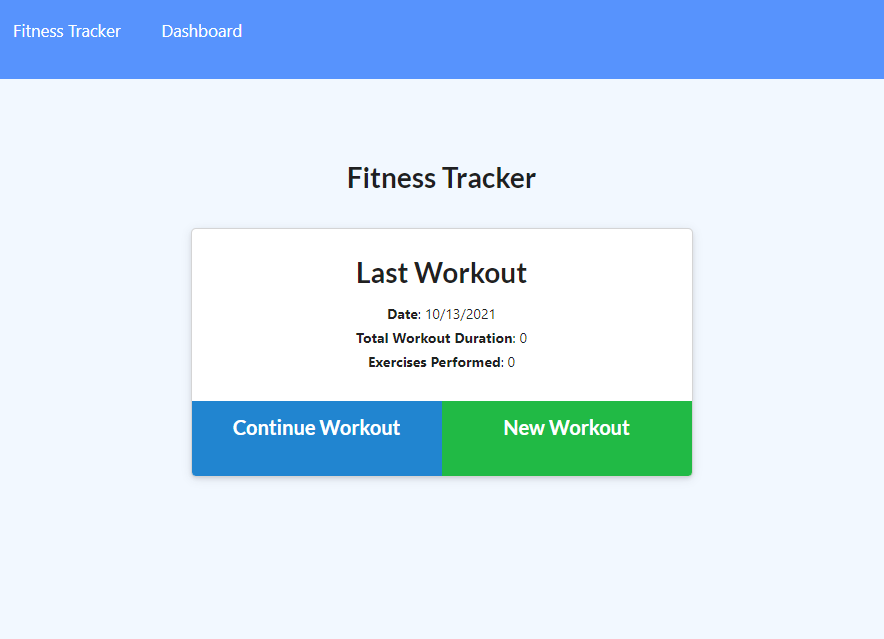
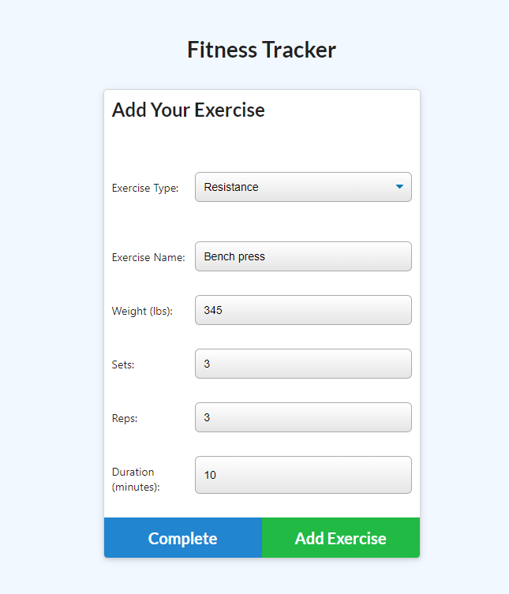
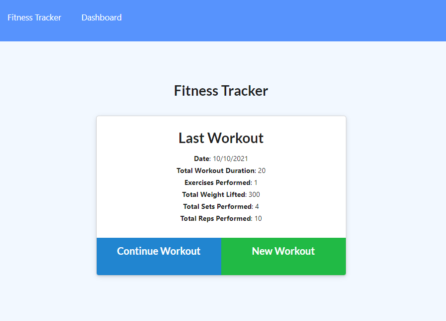
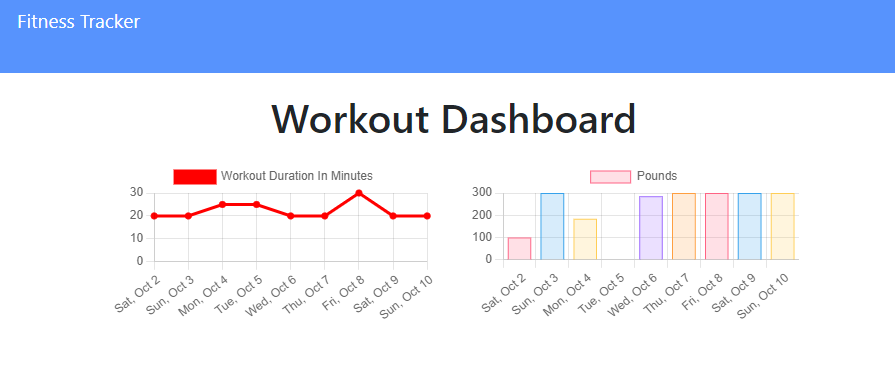

# <ins>Workout Tracker</ins>

## <ins>Description</ins>
This is a Workout Tracker that utilizes MongoDB in order to store an individuals workouts and track the history of those exercises. 
## <ins>Table of Contents</ins>
- [Installation](#installation)
- [Usage](#usage)
- [License](#license)
- [Questions](#questions)

## <ins>Installation</ins>
Type `npm i` or `npm install` in the integrated terminal(if all the files do not install, attempt it again)

You can run the seeds with `node seeders/seed.js`

Run the application with `node server.js`
## <ins>Usage</ins>
Link to Deployed Site:
https://fast-badlands-44381.herokuapp.com/

With this application you are capable of tracking the workouts that you do in a day. For your first entry of the day you would click "New Workout".

As you complete an exercise, whether it is resistance or cardio, you can fill in the form and "Add Exercise". 

Once you are completed with the workout, you can select complete, and you will be taken to a page that shows the details of your last workout. 

You may also look at your dashboard for a couple of graphs depicting the duration and weight used per day that you workout.

## <ins>License</ins>

This project is covered under MIT

## <ins>Questions</ins>
Contact Workout Tracker at aabazary@gmail.com. Github link: https://github.com/aabazary
